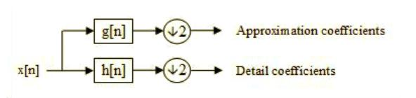
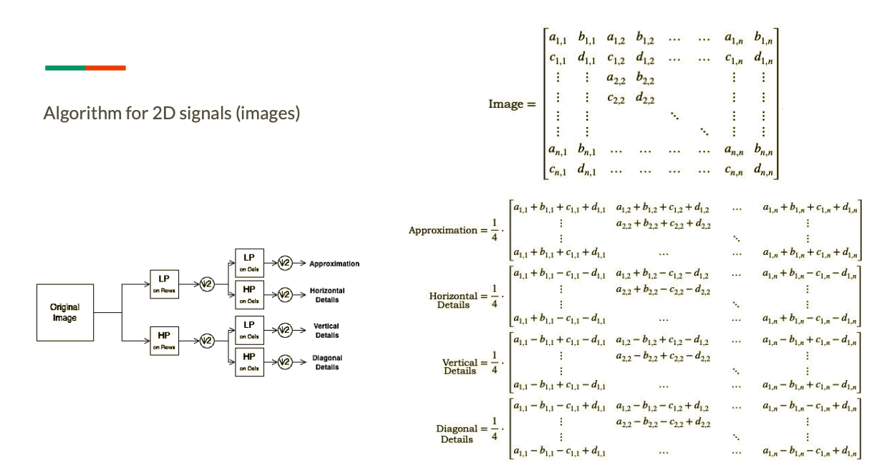

# Parallel-Haar-Transform
Parallel implementation of the Mallat Algorithm for the decomposition of a 2D signal. Project for the exam of Advanced Computer Architecture, master degree in Computer Science, University of Pavia.

Wavelets are a powerful mathematical tool to decompose a signal into its time-frequency components. They are at the basis of many signal processing operations, like compression. For example they are the basis for the JPEG format compression algorithm.
Like in the Fourier transform, the idea is to find out a way to project the signal onto an orthogonal basis. Except, in the wavelet transform, that basis is not only made up of a series of sines and cosines, but rather it is a hierarchy of orthogonal function that get smaller and smaller in time and space. The idea behind this is that Low-frequencies signals tend to last for a long time, so, for those frequencies, the transformation provides information about all the time range of the signal. In the next level of the hierarchy, for higher frequencies, instead, the time space is split in half, because higher frequencies tend to change faster than lower ones, and so on, you can proceed in the hierarchy.

The Mallat algorithm provides a simple basic implementation for computing a Discrete Wavelet Transform. 
Shortly speaking, if you take a signal and you apply a low-pass filtering to that, followed by a down sampling of the result, what you get is an approximation of the original signal. On the other hand, if you apply an high-pass filter, the resulting filter will carry on the details of the original signal.

This can be easily extended to bi dimensional signals, like images. The algorithm states that in this case you can take rows as a first signal and columns as the second one.

The Haar mother wavelet is included in the filtering functions. In the end we can resume the process of applying these filters as we see on the right side of this slide. We can divide the image into 2x2 squared blocks, due to the subsampling made on rows and columns, and then the result of applying the filters is shown by the 4 operations we see below:
- Approximation is the result of 2 low pass filters
- Horizontal details come up from applying a low pass filter on the rows and a high-pass one on columns
- Vertical details are the result of a high pass on rows and a low pass on columns
- Finally Diagonal details are the result of applying 2 high pass filters.

Multi-level decomposition is possible by iteratively repeating the operations on the approximation of the previous level.

